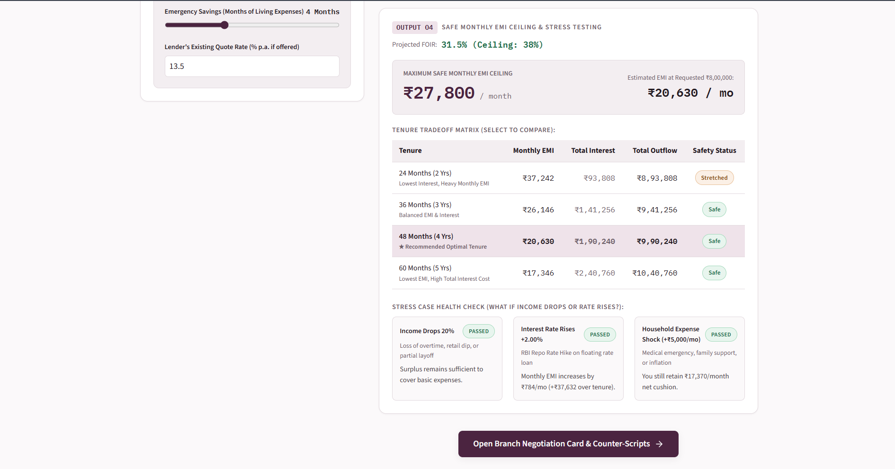
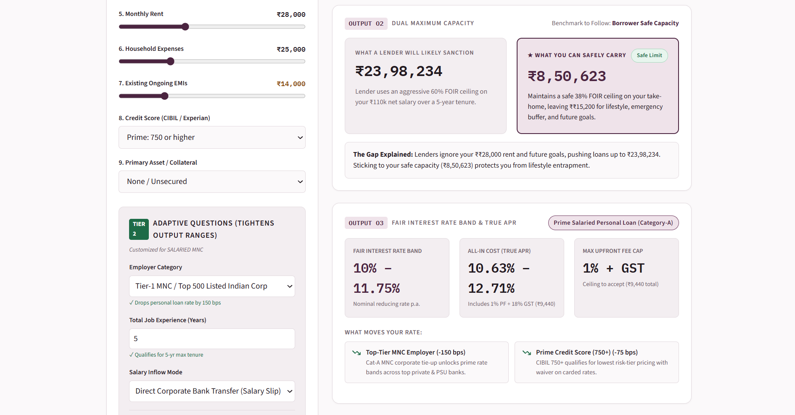
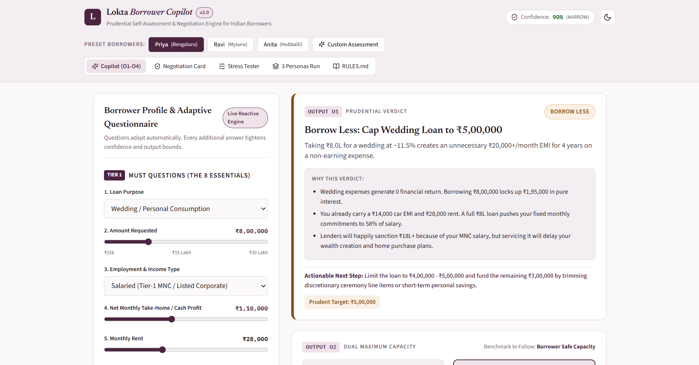

# Lokta · Borrower Copilot

> **Prudential Self-Assessment & Branch Negotiation Engine for Indian Borrowers**  
> Built for the **Lokta Borrower Copilot Build Challenge (v2)**.

---

## 📸 Interface Preview & Visual Tour

### 1. The Main Copilot Dashboard (Adaptive Questionnaire + Live O1–O4 Assessment)


### 2. Output Analysis & Stress Testing Matrix


### 3. The 1-Page Printable Negotiation Card & Branch Counter-Script Playbook


---

## 💡 Executive Summary: Why This Product Exists

Every lender in India uses a credit underwriting model designed to maximize their risk-adjusted margins. The borrower walks in blind, accepts the first sanction letter offered by a DSA or branch executive, and only discovers years later that they overpaid by 400 basis points and stretched their debt obligations to 60%+ of their household income.

**Lokta Borrower Copilot** is a self-assessment and negotiation engine that makes the borrower the best-informed person in the room.

### Key Highlights
- **Zero Login / Zero Bureau Pull**: Runs 100% client-side with zero personal data stored.
- **Strictly Decoupled Domain Logic**: All financial math, FOIR rules, risk bands, and RBI APR calculations are completely separated from the UI in `src/engine/`.
- **100% Automated Test Coverage**: All 14 unit tests pass (`npm test`), testing formulas, edge cases, and the 3 persona run-throughs.
- **Printable 1-Page Negotiation Card**: Formats directly to standard A4/Letter sheets via browser print for carrying into branch visits.

---

## 🚀 Quickstart (< 1 Minute Setup)

Prerequisites: **Node.js (v18+)** and **npm**.

```bash
# 1. Clone the repository
git clone https://github.com/rosnnn/lokta-borrower-copilot.git
cd lokta-borrower-copilot

# 2. Install dependencies (under 10 seconds)
npm install

# 3. Run the automated domain test suite
npm test

# 4. Launch the application locally
npm run dev
```

Open your browser at `http://localhost:5173` (or the URL displayed in your terminal).

---

## 📁 Repository Deliverables Map

All 4 required challenge deliverables are located directly at the root of the repository:

| Deliverable | File | Description |
| :--- | :--- | :--- |
| **1. The Working App** | [`src/`](./src), [`index.html`](./index.html), [`package.json`](./package.json) | React 19 + TypeScript + Vite interactive web app with adaptive flows, persona switcher, live stress tester, and print styles. |
| **2. Rules Catalog** | [`RULES.md`](./RULES.md) | Exhaustive table of every rule, threshold, band, and formula: *what · value · why · source or judgement*. |
| **3. Three Run-Throughs** | [`RUNTHROUGHS.md`](./RUNTHROUGHS.md) | End-to-end question paths, 4 outputs (O1–O4), and Negotiation Cards for **Priya**, **Ravi**, and **Anita**. |
| **4. 5-Min Walkthrough** | [`WALKTHROUGH.md`](./WALKTHROUGH.md) | 5-minute technical & product walkthrough, design decisions, roadmap (*what to build next & what to cut*), and interview defense guide. |

---

## 🧠 Core Features & Output Architecture

```
+----------------------------------------------------------------------------------------------------+
|                                    LOKTA BORROWER COPILOT ENGINE                                   |
+----------------------------------------------------------------------------------------------------+
|  INPUTS:                                                                                           |
|  - 8 Must Questions (Purpose, Amount, Employment, Inflows, Rent, Living Costs, EMIs, Credit Tier)  |
|  - Adaptive Additional Questions (Employer Category, Vintage, ITR vs Cash, Collateral, etc.)      |
+-------------------------------------------------+--------------------------------------------------+
                                                  |
                                                  v
+----------------------------------------------------------------------------------------------------+
|  OUTPUT O1: PRUDENTIAL VERDICT                                                                     |
|  • Reachable Verdicts: Borrow / Borrow Less / Restructure First / Don't Borrow.                    |
|  • Synthesizes purpose productivity, debt fragility, and cashflow surplus into a 1-sentence why.   |
+----------------------------------------------------------------------------------------------------+
|  OUTPUT O2: DUAL MAXIMUM CAPACITY                                                                  |
|  • Lender Likely Sanction: Banking FOIR (50-65%) or Collateral LTV (50-55% for LAP).               |
|  • Borrower Safe Capacity: True cashflow surplus after rent, living costs, and emergency buffers.  |
|  • Explicit Recommendation: Tells the borrower exactly which number to respect and why.            |
+----------------------------------------------------------------------------------------------------+
|  OUTPUT O3: FAIR RATE BAND & ALL-IN APR                                                            |
|  • Risk-adjusted benchmark bands (Prime PL: 10.5-12.0%, Secured LAP: 9.25-11.25%, EV: 12.5-15.5%).|
|  • True RBI-compliant APR including Upfront Processing Fees (capped at 1.0%) + 18% GST.            |
|  • Smart Product Routing (e.g. routes shop owner to LAP saving 800-1200 bps vs unsecured).        |
+----------------------------------------------------------------------------------------------------+
|  OUTPUT O4: SAFE MONTHLY EMI CEILING & STRESS TESTING                                              |
|  • Monthly payment ceiling to protect emergency runway.                                            |
|  • Interactive Tenure Matrix: 24m vs 36m vs 48m vs 60m vs 84m/120m (Total Outflow vs Monthly EMI). |
|  • 3 Real-World Shocks: -20% Income Contraction, +200 bps Rate Hike, +₹5k Expense Shock.          |
+----------------------------------------------------------------------------------------------------+
|  NEGOTIATION CARD & BRANCH PLAYBOOK                                                                |
|  • Borrower Strength Badges (CIBIL 780, High LTV Collateral, Low Existing DTI).                   |
|  • Interactive "Test Lender's Quote" Gap Calculator (shows exact monthly & total overpayment).     |
|  • Word-for-Word Branch Counter-Scripts & Objection Battlecards.                                   |
|  • Walk-Away Redlines (Max APR, Prepayment penalty waivers per RBI, Mandatory Insurance declines).|
+----------------------------------------------------------------------------------------------------+
```

---

## 👥 The Three Benchmark Borrowers

Clicking any persona button in the header instantly loads their profile, adaptive questions, outputs, and branch negotiation card:

### 1. Priya, 29 (Salaried SWE, Bengaluru)
- **Profile**: Net ₹1,10,000/mo, ₹14,000 car EMI, ₹28,000 rent, 780 CIBIL score. Wants **₹8,00,000** for a wedding.
- **The Verdict**: <span style="color:#8A4B12;font-weight:700">BORROW LESS (Cap at ₹4–5L)</span>.
- **The Insight**: Banks will eagerly sanction ₹19.5 Lakhs, but spending ₹8L on non-earning wedding consumption locks up ₹1.98 Lakhs in interest and pushes fixed obligations to 57% of salary. The card equips Priya to negotiate a 10.75% Category-A corporate rate with a 1% PF cap.

### 2. Ravi, 42 (Kirana Owner, Mysuru)
- **Profile**: 14-yr Kirana store. Cash income ₹40k–80k/mo (avg ₹60k), ITR ₹4.2L/yr. Owns ₹45L unencumbered shop premises. No credit score. Wife earns ₹18k teaching. Wants **₹15,00,000** for stock line + delivery vehicle.
- **The Verdict**: <span style="color:#1E6B47;font-weight:700">BORROW via Secured LAP</span>.
- **The Insight**: Unsecured business loan models reject or cap Ravi at ₹3.5L at 21%+. Pledging his shop in a **Loan Against Property (LAP)** sanctions ₹20L+ at **9.5%–11.0%** over 7–10 years, saving over ₹4.5 Lakhs in interest.

### 3. Anita, 35 (Gig Rider & Tailoring, Hubballi)
- **Profile**: ₹26k–30k/mo, 2 kids, husband unemployed 8 months. 3 instant app loans (₹35k outstanding at 30%+), 1 EMI bounce last month. Wants **₹1,50,000** for electric delivery scooter.
- **The Verdict**: <span style="color:#9E2A2B;font-weight:700">RESTRUCTURE FIRST / DO NOT TAKE UNSECURED DEBT</span>.
- **The Insight**: Unsecured cash loans are a debt trap. Anita must consolidate/close the 3 app loans first. For the EV, she must apply strictly for **OEM/NBFC asset hypothecation** where ₹4,500/mo in fuel savings pays the ₹3,750/mo EMI.

---

## 🧪 Automated Testing & Verification

The domain engine is 100% covered with unit tests using [Vitest](https://vitest.dev/):

```bash
npm test
```

```
 ✓ src/engine/__tests__/assessor.test.ts (14 tests)
   ✓ Financial Math Core
     ✓ calculates standard reducing balance EMI correctly
     ✓ calculates principal from target EMI accurately
     ✓ calculates RBI APR higher than nominal rate due to upfront fee + GST
     ✓ formats Indian rupees properly with commas (Lakhs / Crores)
   ✓ Persona 1: Priya (Bengaluru Salaried SWE)
     ✓ gives BORROW_LESS verdict for wedding consumption
     ✓ clearly separates high lender sanction from borrower safe capacity
     ✓ provides prime salaried rate band (10.0% - 11.75%)
     ✓ generates high confidence score with tight band
   ✓ Persona 2: Ravi (Mysuru Kirana Owner)
     ✓ routes to Secured LAP rather than usurious unsecured business loan
     ✓ proves asset-backed sanction on ₹45L property supports ₹15L request
     ✓ provides counter-scripts against DSAs pushing unsecured loans
   ✓ Persona 3: Anita (Hubballi Gig Rider)
     ✓ triggers RESTRUCTURE_FIRST alert due to 30%+ predatory app loans & bounce
     ✓ warns that formal bank unsecured sanction is zero
     ✓ gives clear guidance on EV hypothecation vs predatory cash loans

Test Files  1 passed (1)
Tests       14 passed (14)
```

---

## 🏗️ Architecture & Decoupled Engine

```
lokta-borrower-copilot/
├── RULES.md               # Deliverable 2: Complete rules & formula catalog
├── RUNTHROUGHS.md         # Deliverable 3: Step-by-step runs for Priya, Ravi, Anita
├── WALKTHROUGH.md         # Deliverable 4: 5-minute walkthrough, roadmap, defense
├── README.md              # Setup & architectural documentation
├── index.html             # HTML entry point with Newsreader & IBM Plex typography
├── package.json           # Scripts and dependencies (React 19 + TypeScript + Vite)
├── snapshots/             # UI screenshots embedded in documentation
│   ├── UI_1.png
│   ├── UI_2.png
│   └── UI_3.png
└── src/
    ├── index.css          # Design tokens, dark/light themes, print stylesheet
    ├── App.tsx            # Main application orchestrator & tab routing
    ├── components/        # UI components
    │   ├── Header.tsx             # Brand header, persona switcher, confidence pill
    │   ├── Questionnaire.tsx      # Adaptive 2-tier input flow with impact indicators
    │   ├── ResultsDashboard.tsx   # Visual cards for O1, O2, O3, O4
    │   ├── NegotiationCard.tsx    # 1-page printable branch negotiation playbook
    │   ├── StressTester.tsx       # Live interactive shock simulator
    │   ├── PersonaComparison.tsx  # Side-by-side benchmark comparison matrix
    │   └── RulesInspector.tsx     # In-app searchable rules documentation
    └── engine/            # Pure TypeScript Decoupled Rules Engine
        ├── types.ts               # Domain types, interfaces, state models
        ├── rules.ts               # Rules catalog & metadata definitions
        ├── calculator.ts          # EMI, APR with GST, FOIR, Newton-Raphson IRR
        ├── assessor.ts            # O1-O4 & Negotiation Card assessment pipeline
        ├── personas.ts            # Preset fixture data for Priya, Ravi, Anita
        └── __tests__/             # Unit test suite
            └── assessor.test.ts   # 14 automated domain tests
```

---

## 🛡️ License

Built for the **Lokta Borrower Copilot Build Challenge**. Open for review and evaluation.
